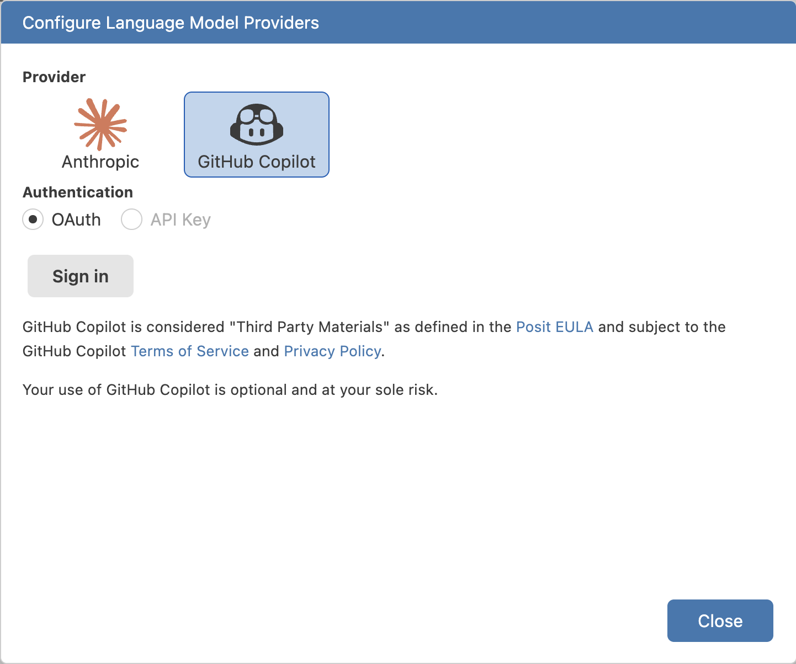
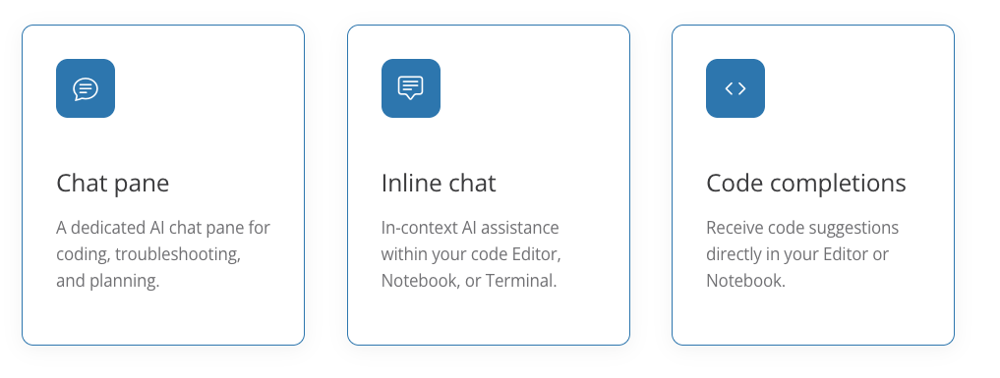
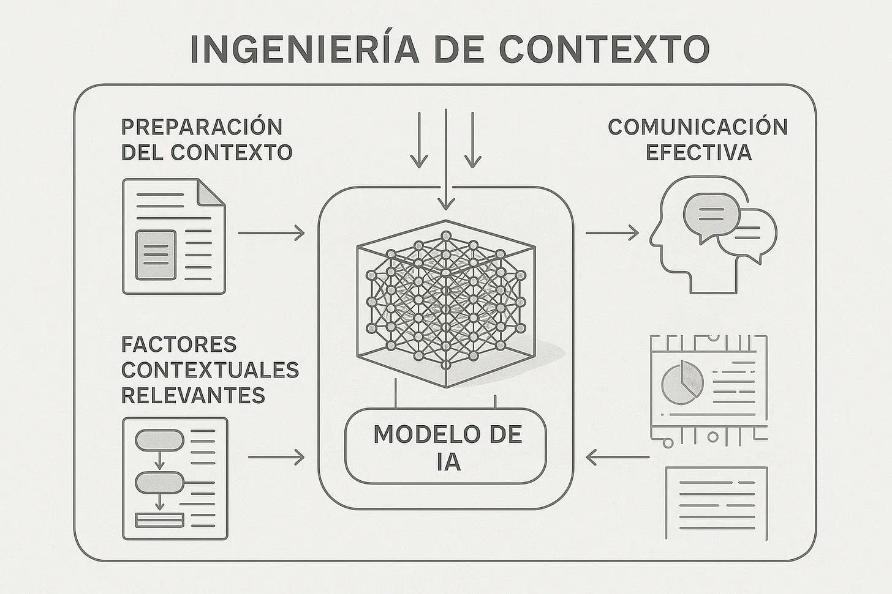
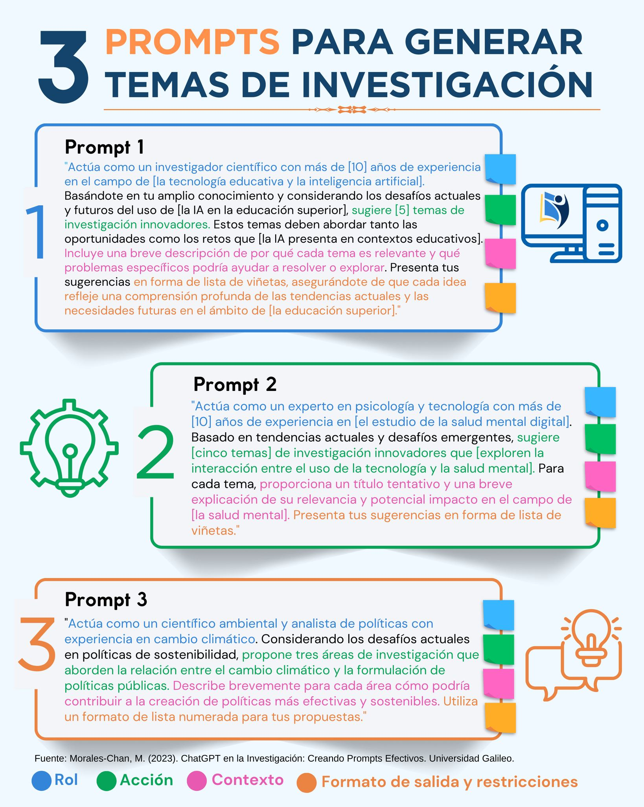
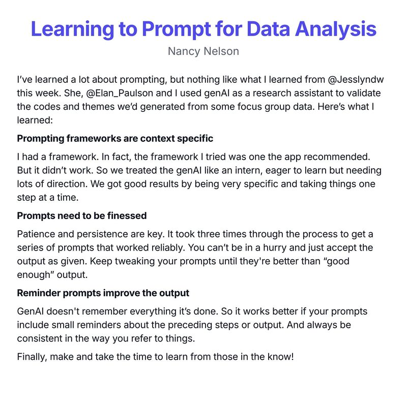

# Asistente de IA en Positron

## Positron Assistant

- **Asistente de IA para ciencia de datos**: Construido específicamente para workflows de data science
- **Contexto ampliado**: Acceso a datos cargados, plots, historial de consola además de archivos activos
- **Chat pane dedicado**: Panel de chat AI para programación, troubleshooting y planificación
- **Inline chat**: Asistencia AI en contexto dentro del Editor, Notebook o Terminal
- **Code completions**: Sugerencias de código directamente en Editor o Notebook
- **Preview disponible**: Desde Positron 2025.07.0-204

**Fuente**: [Positron Assistant](https://positron.posit.co/assistant.html)

## Positron Assistant

{width=80% fig-align="center"}

## Chat y Agentes

{width=80% fig-align="center"}

## Chat y Agentes

- **Chat pane**: Panel dedicado para conversaciones con el asistente sobre código
- **Inline chat**: Asistencia contextual seleccionando código en el editor
- **Code completions**: Sugerencias automáticas mientras escribes código
- **Contexto de data science**: El asistente entiende tus datos, plots y sesión activa
- **Multi-lenguaje**: Soporte para Python, R y otros lenguajes
- **BYO-key**: Trae tu propia clave de API del proveedor de modelos (Anthropic, OpenAI, GitHub Copilot, AWS Bedrock)

## Uso del Chat

- **Abrir Chat pane**: Desde Activity Bar o Command Palette
- **Preguntas sobre código**: Explicar funciones, encontrar errores, optimizar código
- **Generar código**: Solicitar funciones o scripts basados en tus datos
- **Contexto automático**: El asistente ve tu código seleccionado, archivos abiertos y estructura del proyecto
- **Historial de conversación**: Mantiene contexto de conversaciones previas
- **Integración con consola**: Puede ver outputs y resultados de ejecuciones

## Completado de código (Completions)

- **Sugerencias automáticas**: Basadas en contexto de tu código y proyecto
- **Multi-línea**: Genera bloques completos de código, no solo palabras
- **Context-aware**: Entiende tu proyecto, datos cargados y patrones de código
- **Multi-lenguaje**: Python, R, SQL y otros lenguajes soportados
- **Activar/desactivar**: Configurable desde settings, se puede desactivar si no se necesita
- **Mejora con uso**: Aprende de tus patrones de código y preferencias

## Ingeniería de prompt

{width=80% fig-align="center"}

## Ingeniería de prompt

{width=80% fig-align="center"}

## Ingeniería de prompt

{width=80% fig-align="center"}

## Ingeniería de prompt

{width=80% fig-align="center"}

## Un mal prompt

```
Hazme un modelo de calor y parto pretérmino
```

**Problemas:**

- No especifica qué tipo de modelo (regresión, clasificación, etc.)
- No menciona variables disponibles
- No indica el objetivo del análisis
- Falta contexto sobre los datos
- No especifica software/paquetes a usar

## Un buen prompt

```
Necesito proponer un modelo estadístico para analizar la asociación entre 
exposición a calor extremo y riesgo de parto pretérmino (<37 semanas).

Contexto:
- Base de datos: Registro de nacimientos de Santiago 1992-2020
- Variable respuesta: parto_pretérmino (binaria: sí/no)
- Variables predictoras disponibles: temperatura_máxima_diaria, humedad_relativa, 
  trimestre_gestacional_exposición, edad_materna, nivel_educacional, área_residencial
- Objetivo: Estimar odds ratio ajustado de parto pretérmino por aumento de 1°C 
  en temperatura máxima, controlando por covariables

Por favor propón:
1. Tipo de modelo apropiado (regresión logística, GAM, etc.)
2. Estructura del modelo con variables principales y de control
3. Código en R usando tidyverse y posiblemente mgcv para efectos no lineales
4. Consideraciones para exposición acumulada vs. aguda al calor
```

## Un buen prompt

**Ventajas:**

- ✅ Especifica claramente el objetivo y tipo de análisis
- ✅ Proporciona contexto sobre datos y variables disponibles
- ✅ Indica software y paquetes preferidos
- ✅ Solicita estructura específica del modelo
- ✅ Considera aspectos metodológicos relevantes


## Cursor

:::: {.columns}

::: {.column width="30%"}
{width=70% fig-align="center"}
:::

::: {.column width="70%"}

Editor de código basado en VS Code con IA integrada para desarrollo de software

- **Composer**: Edición multi-archivo con contexto completo del proyecto (requiere suscripción)
- **Chat contextual**: Conversaciones sobre código con acceso a múltiples archivos simultáneos
- **Codebase indexing**: Indexación inteligente del repositorio completo para mejor contexto

Pueden ver aquí: <https://cursor.com/>

:::

::::

## Cursor

- **Multi-modelo**: Soporte para GPT-4, Claude, y modelos locales (vía LM Studio u Ollama)
- **Rules y Skills**: Sistema de reglas personalizables (`.cursorrules`) para guiar el comportamiento del AI
- **Composer mode**: Permite editar múltiples archivos en una sola conversación

## Cursor: Ventajas para Ciencia Abierta

- **Reproducibilidad**: Facilita generar código documentado, estructurado y con mejores prácticas
- **Colaboración**: Mejora la calidad del código compartido en repositorios públicos (GitHub, GitLab)
- **Aprendizaje**: Ayuda a investigadores sin experiencia a escribir código de calidad profesional
- **Eficiencia**: Acelera desarrollo de scripts de análisis, visualizaciones y pipelines de datos

## Cursor: Ventajas para Ciencia Abierta

- **Multi-lenguaje**: Soporte robusto para Python, R, JavaScript, SQL, Julia y más
- **Integración Git**: Facilita versionado, commits y contribuciones a proyectos open-source
- **Documentación**: Genera automáticamente comentarios y documentación inline
- **Debugging**: Identifica errores y sugiere correcciones rápidamente

## Cursor: Desventajas para Ciencia Abierta

- **Costo**: Requiere suscripción ($20/mes) para funciones avanzadas (Composer, mejor contexto)
- **Dependencia de APIs**: Modelos cloud (GPT-4, Claude) requieren conexión y tienen costos por uso
- **Privacidad**: Código sensible puede enviarse a servicios externos (configurable con modelos locales)
- **Curva de aprendizaje**: Requiere aprender a escribir prompts efectivos y configurar reglas

## Cursor: Desventajas para Ciencia Abierta

- **Over-reliance**: Riesgo de depender demasiado sin entender el código generado
- **Licencias**: Verificar que código generado cumpla con licencias de proyectos (MIT, GPL, etc.)
- **Calidad variable**: Respuestas pueden variar y requerir múltiples iteraciones
- **Limitaciones contexto**: Aunque amplio, tiene límites en proyectos muy grandes

## LM Studio

{width=70%} 

Pueden ver aquí: <https://lmstudio.ai/>

## LM Studio

Plataforma para ejecutar modelos de lenguaje grandes (LLMs) localmente en tu computadora

- **Ejecución local**: Modelos corren completamente en tu máquina (CPU/GPU)
- **Sin conexión**: Funciona completamente offline una vez descargado el modelo
- **Multi-modelo**: Soporte para Llama 2/3, Mistral, Phi, CodeLlama y otros modelos open-source
- **API local**: Expone modelos como servidor API (compatible con OpenAI API) para usar con Cursor, Positron, etc.
- **Gratuito**: Software open-source sin costos de suscripción ni límites de uso

## LM Studio: Ventajas para Ciencia Abierta

- **Cuantización**: Optimiza modelos para ejecutarse eficientemente en hardware limitado
- **Privacidad total**: Datos sensibles (datos clínicos, encuestas, información personal) nunca salen de tu computadora
- **Sin costos**: No hay límites de uso ni costos por token después de la descarga inicial
- **Control completo**: Tienes control total sobre el modelo, parámetros (temperatura, top-p) y configuración
- **Reproducibilidad**: Mismo modelo + misma configuración = resultados idénticos, sin variabilidad de APIs cloud

## LM Studio: Ventajas para Ciencia Abierta

- **Open-source**: Modelos y herramientas alineados con principios de ciencia abierta y FAIR
- **Sin restricciones**: No hay límites de rate limiting, políticas de uso restrictivas ni censura
- **Investigación**: Permite experimentar con diferentes modelos, fine-tuning y configuraciones
- **Compliance**: Cumple con regulaciones de protección de datos (GDPR, HIPAA) al mantener datos locales
- **Transparencia**: Puedes auditar exactamente qué modelo y versión estás usando

## LM Studio: Desventajas para Ciencia Abierta

- **Requisitos hardware**: Necesita GPU potente (NVIDIA con 8GB+ VRAM) o mucha RAM (16GB+) para modelos grandes
- **Velocidad**: Más lento que servicios cloud optimizados (segundos vs milisegundos por respuesta)
- **Calidad**: Modelos locales generalmente menos capaces que GPT-4/Claude en tareas complejas y razonamiento
- **Configuración**: Requiere más conocimiento técnico para configurar, optimizar y resolver problemas

## LM Studio: Desventajas para Ciencia Abierta

- **Espacio**: Modelos grandes ocupan 4-70GB de almacenamiento (dependiendo del modelo y cuantización)
- **Mantenimiento**: Necesitas actualizar modelos y software manualmente, sin actualizaciones automáticas
- **Limitaciones**: Algunos modelos locales tienen limitaciones en tareas complejas, matemáticas avanzadas y código
- **Energía**: Consume más energía localmente que usar APIs cloud optimizadas
- **Disponibilidad**: Requiere tener el hardware encendido y disponible cuando necesitas usarlo 

## ¿Cuándo usar cada herramienta?

**Cursor + Cloud APIs** (GPT-4, Claude)

- Proyectos que requieren alta calidad de código
- Cuando la privacidad no es crítica
- Presupuesto disponible para suscripciones
- Necesitas velocidad y resultados inmediatos

## ¿Cuándo usar cada herramienta?

**Cursor + LM Studio** (Modelos locales)

- Balance entre privacidad y funcionalidad
- Datos sensibles pero necesitas funciones avanzadas de Cursor
- Control sobre qué modelo usar sin costos adicionales

## ¿Cuándo usar cada herramienta?

**LM Studio standalone**

- Máxima privacidad requerida (datos clínicos, encuestas sensibles)
- Sin presupuesto para APIs
- Investigación que requiere reproducibilidad exacta
- Compliance estricto con regulaciones de datos

## Mejores prácticas con IA

- **Sé específico**: Preguntas claras y detalladas dan mejores respuestas
- **Proporciona contexto**: Menciona paquetes, datos y objetivos específicos
- **Revisa el código**: Siempre verifica y prueba el código generado antes de publicar
- **Aprende de las explicaciones**: Usa las respuestas para entender mejor el código, no solo copiar
- **Itera**: Refina tus preguntas según necesites más información
- **Privacidad**: Considera usar modelos locales (LM Studio) para datos sensibles

## Mejores prácticas con IA
- **Documentación**: Documenta el uso de IA en tus métodos y agradecimientos
- **Reproducibilidad**: Especifica qué modelo y versión usaste si es relevante para tu investigación
- **Licencias**: Verifica que código generado cumpla con licencias de tu proyecto
- **Transparencia**: Sé transparente sobre el uso de IA en ciencia abierta
